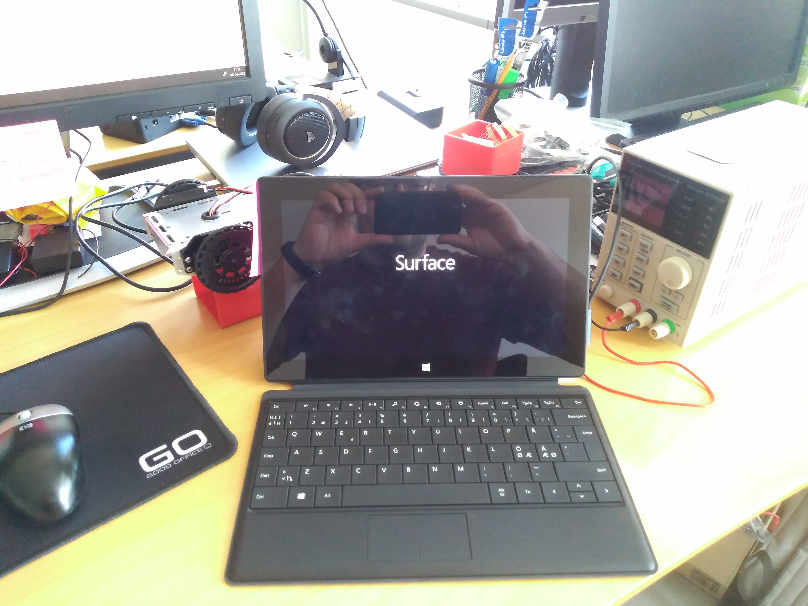

# MS-Surface RT - upgrade

We had 10 Surface sponsered to us from another school. And we wanted to do a project about getting to Old RT version updated or replaced.

The tablets might not be that good as working desktops, but at least theres a pretty good touch screen. That combined with ex. progressive web application could make for some interesting projects for the students.

## Possible OS
* Windows RT updated
* Windows 10
* Windows

## Desired function
* Full functioning 
* Chrome browser
* Edge browser
* Security software

## Inspiration
